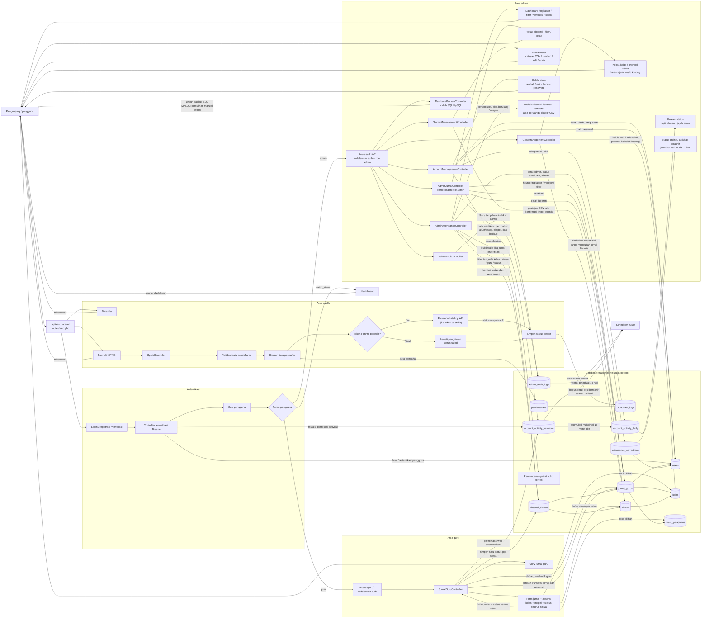

# Arsitektur SMAIT Al-Hayyu

Diagram berikut merangkum alur aplikasi Laravel berdasarkan route, controller,
model, dan view yang tersedia.

## Ringkasan alur

- Pendaftaran SPMB dapat dilakukan tanpa login. Data pendaftar disimpan sebelum
  pengiriman pesan WhatsApp; hasil pengiriman dicatat di `broadcast_logs`.
- Guru yang sudah login membuat jurnal mengajar. Jurnal baru berstatus `pending`
  dan terhubung ke pengguna, kelas, serta mata pelajaran. Status absensi setiap
  siswa dalam kelas wajib dipilih sebelum jurnal dan absensi disimpan bersama.
- Admin membuka dashboard monitoring di `/admin/dashboard` untuk melihat
  ringkasan, memfilter jurnal, memverifikasi, dan mencetak laporan. Pemeriksaan
  peran admin dilakukan di controller; pengguna non-admin ditolak.
- Admin membuka `/admin/absensi` untuk memfilter, mencetak rekap, dan melakukan
  koreksi absensi dengan alasan wajib. Riwayat menyimpan admin, nilai lama/baru,
  keterangan, dan waktu koreksi. Koreksi jurnal terverifikasi memerlukan bukti
  PDF/JPG/PNG yang disimpan privat. Analisis per bulan/semester menampilkan
  persentase berdasarkan catatan yang ada, menandai minimal tiga alpa, dan dapat
  diekspor ke CSV.
- Admin mengelola roster di `/admin/students`: menambah, mengubah, memindahkan
  kelas, mengimpor CSV setelah pratinjau dan konfirmasi, mengarsipkan, atau
  mengaktifkan kembali siswa. Arsip menggunakan soft delete sehingga catatan
  absensi tetap utuh; siswa yang diarsipkan tidak muncul di roster untuk jurnal
  baru. NISN tetap unik dan tidak dapat dipakai ulang selama record arsip ada.
- Admin mengelola wali kelas dan roster kelas di `/admin/classes`. Promosi
  memindahkan semua siswa aktif ke kelas tujuan yang kosong sehingga jurnal
  lama tetap terhubung ke kelas historis. Nama kelas yang sudah dipakai jurnal
  tidak dapat diubah.
- Route dashboard mengarahkan guru dan admin ke fitur masing-masing, sedangkan
  calon siswa dan peran lainnya melihat halaman dashboard.
- Admin mengelola akun melalui `/admin/accounts`. Penghapusan akun menggunakan
  soft delete agar jurnal dan riwayat aktivitas terkait tetap tersimpan.
- Sesi aktivitas mencatat login, aktivitas terakhir, logout, dan durasi aktif.
  Heartbeat dikirim saat halaman terlihat dan ada aktivitas pengguna; waktu idle
  dibatasi 15 menit dan durasi harian dipisah pada pergantian tanggal.
- Audit tindakan admin dan detail sesi berakhir dihapus terjadwal setelah 14
  hari; agregat `account_activity_daily` dan riwayat operasional jurnal/absensi
  tidak termasuk retensi audit.
- Admin dapat mengunduh backup SQL dari MySQL. Pemulihan sengaja tidak tersedia
  melalui dashboard dan harus dijalankan manual oleh teknisi.
- `siswas` terhubung ke kelas dan setiap catatan absensi memastikan hanya ada satu
  status siswa untuk jurnal yang sama.
