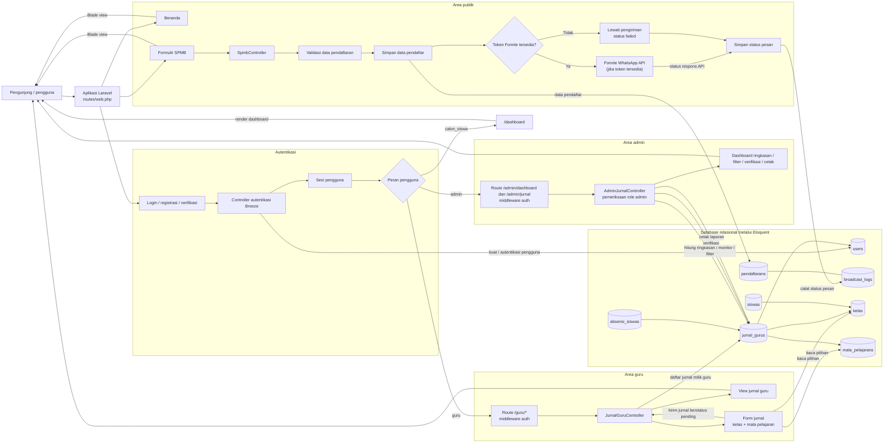

# Arsitektur SMAIT Al-Hayyu

Diagram berikut merangkum alur aplikasi Laravel berdasarkan route, controller,
model, dan view yang tersedia.

## Ringkasan alur

- Pendaftaran SPMB dapat dilakukan tanpa login. Data pendaftar disimpan sebelum
  pengiriman pesan WhatsApp; hasil pengiriman dicatat di `broadcast_logs`.
- Guru yang sudah login membuat jurnal mengajar. Jurnal baru berstatus `pending`
  dan terhubung ke pengguna, kelas, serta mata pelajaran.
- Admin membuka dashboard monitoring di `/admin/dashboard` untuk melihat
  ringkasan, memfilter jurnal, memverifikasi, dan mencetak laporan. Pemeriksaan
  peran admin dilakukan di controller; pengguna non-admin ditolak.
- Route dashboard mengarahkan guru dan admin ke fitur masing-masing, sedangkan
  calon siswa dan peran lainnya melihat halaman dashboard.
- `siswas` dan `absensi_siswas` ditampilkan sebagai model data terkait; keduanya
  belum memiliki alur aktif pada route yang digambarkan.
